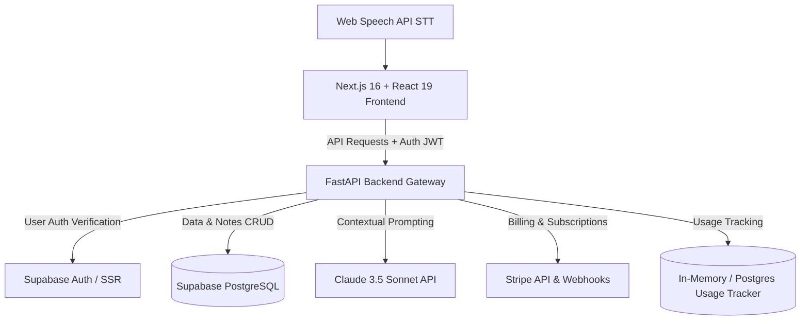

# 🧠 Memoria V2

<p align="center">
  
  
  
  
  
  
</p>

---

## 📖 Overview

**Memoria V2** is an advanced **AI-Powered Lecture Intelligence Platform** designed to act as a digital second brain for college students, teachers, and researchers. It converts multi-source lecture formats—live voice recording, YouTube videos, documents, and notes—into comprehensive study kits featuring AI-generated structured notes, flashcards, interactive quizzes, dynamic conceptual diagrams, and multi-agent deep research capabilities.

Equipped with a secure **Supabase Authentication** layer, collaborative **Multi-User Workspaces**, and a full-featured **Stripe Subscription Billing** module, Memoria V2 provides a seamless, robust enterprise-grade learning management experience.

---

## ✨ Key Features

Memoria V2 is a fully realized multi-tier application. Here is the current state of implemented modules:

### 📥 Multi-Channel Lecture Ingestion
*   🎙️ **Live Audio Ingestion**: Real-time microphone capture and browser-level transcription powered by the Web Speech API.
*   📺 **YouTube Video Ingestion**: Paste any public YouTube link; the backend extracts transcripts and feeds them to the AI pipeline.
*   📄 **Rich Content Formats**: Full processing of lecture notes, structured transcripts, and textual summaries.

### 🧠 Claude 3.5 Sonnet-Powered Intelligence
*   📝 **Automated Study Notes**: AI-generated lecture syntheses, executive summaries, actionable key takeaways, exam prep questions, and reminders.
*   📊 **Dynamic Concept Mapping**: Generates clean, interactive **Mermaid.js** syntax diagrams automatically to map complex systems or historical flows.
*   💬 **Context-Aware AI Chat**: Ask questions, request expansions, or clarify topics directly with an AI trained on your lecture's context.
*   🔬 **SSE Deep Research**: Multi-agent orchestration to conduct deep analysis of notes, returning live status streams to the client via Server-Sent Events (SSE).

### 🗂️ Collaborative Spaces & Tools
*   📇 **Interactive Flashcard Engine**: Auto-generates customized flashcard decks categorized by topic and difficulty level.
*   ❓ **Multiple Choice Quizzes**: Create on-the-fly exam practice quizzes with timers.
*   👥 **Multi-User Workspaces**: Create dedicated folders for shared study sessions or project work groups with granular **Role-Based Access Control (RBAC)**: `Owner`, `Admin`, `Editor`, and `Viewer`.

### 💳 Stripe & Usage Infrastructure
*   🛡️ **Secure Authentication**: End-to-end sessions managed via Supabase SSR Authentication.
*   💳 **Subscription System**: Four subscription plans (Explorer, Pro, Premium, Team) synced to Stripe billing intervals.
*   ⚡ **Daily Usage Enforcement**: Strict rate limits (AI queries, YouTube imports, flashcard and quiz generations) tracked daily to manage API overhead.

### 🔒 Security & Data Isolation
*   🛡️ **Row-Level Security (RLS)**: Database tables enforce strict RLS policies, ensuring users can only read, write, or delete their own notes and flashcards.
*   🔑 **JWT Token Validation**: Backend requests are authenticated via Supabase JWT access tokens, which are cryptographically verified using `SUPABASE_JWT_SECRET` by FastAPI dependencies before executing routers.
*   📦 **Zero-Leak Secret Architecture**: Critical API keys (Anthropic/Groq, Stripe, Supabase Service role keys) are completely isolated backend-side and never exposed to the client-side browser bundle.

---

## 🛠️ Architecture & Tech Stack



### Stack Breakdown

| Layer | Technologies |
|---|---|
| **Frontend** | React 19 · Next.js 16 (App Router) · TypeScript · Tailwind CSS v4 · Framer Motion · shadcn/ui |
| **Backend** | FastAPI · Pydantic · Python 3.10+ · Uvicorn |
| **Database** | Supabase PostgreSQL |
| **Authentication** | Supabase SSR Session Provider |
| **AI Processing** | Claude 3.5 Sonnet (via Anthropic API) |
| **Payment Gateway** | Stripe (Checkout, Webhooks, Billing Portal) |
| **Visual Mapping** | Mermaid.js (Client-side Renderer) |

---

## 📂 Repository Structure

```
memoria-v2-clean/
├── frontend/
│   ├── app/
│   │   ├── (auth)/             # Login and Sign-Up authentication views
│   │   ├── ask/                # AI Chat Q&A and Deep Research view
│   │   ├── flashcards/         # Interactive card review page
│   │   ├── notes/              # Notes library, details & editor
│   │   ├── pricing/            # Stripe tier cards & plan subscriptions
│   │   ├── quiz/               # Interactive multiple choice quizzes
│   │   ├── record/             # Live mic recording & transcript tracker
│   │   ├── search/             # Global full-text search layout
│   │   ├── settings/           # User billing information
│   │   ├── youtube/            # YouTube transcript extractor
│   │   ├── globals.css         # Tailwind v4 configuration and design tokens
│   │   └── layout.tsx          # Main viewport wrapping sidebar dock navigation
│   ├── components/             # Custom & shadcn core UI elements
│   ├── lib/                    # Supabase SSR client, API wrappers & ts utilities
│   └── package.json
├── backend/
│   ├── app/
│   │   ├── main.py             # App instantiation & CORS mounting
│   │   ├── config.py           # Settings validation via Pydantic BaseSettings
│   │   ├── dependencies.py     # FastAPI Dependency Injections (Auth, DB, Settings)
│   │   ├── middleware/         # Stripe subscriptions & limit checker filters
│   │   ├── migrations/         # PostgreSQL schema DDL SQL scripts
│   │   ├── models/             # Database Schemas & Pydantic request models
│   │   ├── routers/            # Routers (notes, youtube, ask, billing, workspaces, etc.)
│   │   └── services/           # Business logic (ai_service, stripe_service, usage_service)
│   ├── requirements.txt        # Backend python packages
│   └── .env.example            # Environment configuration template
├── docs/                       # PRD, Architecture, Rules, and Roadmaps
└── README.md                   # Project documentation
```

---

## ⚙️ Local Development Setup

### 1. Prerequisites
Ensure you have the following installed:
*   **Node.js** (v18+)
*   **Python** (3.10+)
*   A **Supabase** account and project
*   An **Anthropic API Key** (or Groq for fallback)
*   A **Stripe** developer account

### 2. Database Schema Initialization
Run the DDL scripts in [backend/app/migrations](file:///Users/aaryankhanna/Downloads/memoria-v2-clean-main/backend/app/migrations) via your Supabase SQL editor or CLI tool:
1.  Run `001_subscription_tables.sql` to generate subscription, daily usage, and payment tables (this will also seed the Explorer, Pro, Premium, and Team plans).
2.  Run `002_team_workspaces.sql` to add support for workspaces, workspace membership, and link notes to workspaces.

### 3. Backend Setup
1.  Navigate to the backend directory:
    ```bash
    cd backend
    ```
2.  Create and activate a python virtual environment:
    ```bash
    python -m venv venv
    source venv/bin/activate  # On Windows, use: venv\Scripts\activate
    ```
3.  Install dependencies:
    ```bash
    pip install -r requirements.txt
    ```
4.  Configure environment variables:
    ```bash
    cp .env.example .env
    ```
    Open `.env` and fill in your keys:
    *   `ANTHROPIC_API_KEY`: Anthropic developer key.
    *   `SUPABASE_URL` / `SUPABASE_SERVICE_KEY` / `SUPABASE_JWT_SECRET`: From Supabase project settings.
    *   `STRIPE_SECRET_KEY` / `STRIPE_WEBHOOK_SECRET` / `STRIPE_PRICE_*`: Stripe secrets and plan IDs.

5.  Start the FastAPI server:
    ```bash
    uvicorn app.main:app --host 0.0.0.0 --port 8000 --reload
    ```

### 4. Frontend Setup
1.  Navigate to the frontend directory:
    ```bash
    cd frontend
    ```
2.  Install packages:
    ```bash
    npm install
    ```
3.  Configure environment variables:
    ```bash
    cp .env.local.example .env.local
    ```
    Open `.env.local` and match it to your Supabase and API paths:
    ```env
    NEXT_PUBLIC_SUPABASE_URL=https://your-project-ref.supabase.co
    NEXT_PUBLIC_SUPABASE_ANON_KEY=your-supabase-anon-key
    NEXT_PUBLIC_API_URL=http://localhost:8000
    ```
4.  Run the Next.js development server:
    ```bash
    npm run dev
    ```
5.  Access the web client at [http://localhost:3000](http://localhost:3000).

---

## 📊 Database Schema Details

Memoria V2 uses a relational PostgreSQL database on Supabase. Below is a breakdown of the key tables:

```
                  ┌───────────────┐
                  │  auth.users   │
                  └───────┬───────┘
                          │
         ┌────────────────┼────────────────┬───────────────┐
         ▼                ▼                ▼               ▼
┌─────────────────┐ ┌───────────┐ ┌────────────────┐ ┌───────────┐
│user_subscriptions│ │workspaces │ │  usage_daily   │ │   notes   │
└────────┬────────┘ └─────┬─────┘ └────────────────┘ └─────┬─────┘
         │                │                                │
         ▼                ▼                                ▼
┌─────────────────┐ ┌───────────┐                    ┌───────────┐
│ payment_history │ │wksp_members│                    │flashcards │
└─────────────────┘ └───────────┘                    └───────────┘
```

*   **`notes`**: Holds summaries, tags/topics, raw transcripts, bullet points, study schedules, and dynamic Mermaid diagrams. Scoped to a `workspace_id`.
*   **`flashcards`**: Stores AI-generated flashcard objects containing question contents, answers, sorted indexes, and difficulty levels.
*   **`workspaces`** & **`workspace_members`**: Manages teams, collaborative folder shares, and access levels (RBAC roles).
*   **`subscription_plans`** & **`user_subscriptions`**: Keeps track of current client tiers, stripe synchronization details, and active billing dates.
*   **`usage_daily`**: Captures daily operation telemetry (such as YouTube link runs and AI query counts) to enforce plan rules.

---

## 📸 Screenshots

*Screenshots and UI demos coming soon.*

---

## 🤝 Contributing

Contributions are welcome! Please follow the instructions detailed in the [docs/rules.md](file:///Users/aaryankhanna/Downloads/memoria-v2-clean-main/docs/rules.md) for architectural guidelines, naming conventions, and pull request rules.

---

## 📄 License

This project is open-source and available under the MIT License.

---

## 👨‍💻 Author

**Aaryan Khanna** — [GitHub](https://github.com/Aaryan-336)
